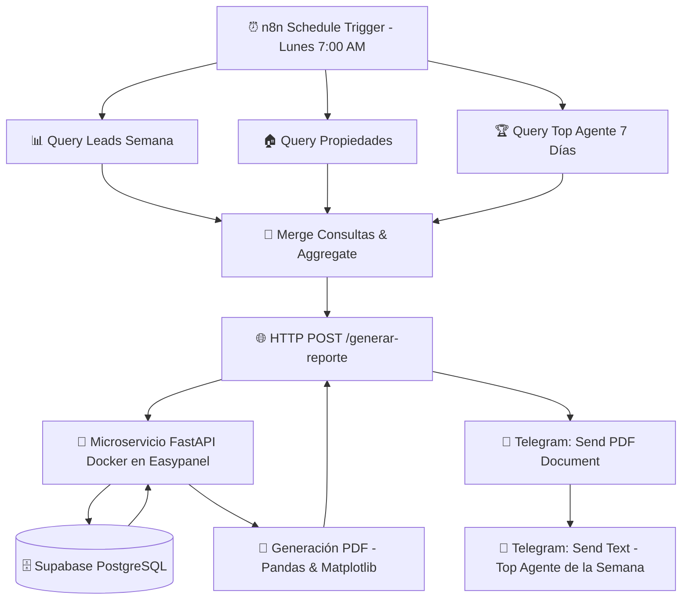

# 🏢 Inmobiliaria Reportes Automatizados

Este proyecto demuestra la creación de un sistema **ETL y de automatización empresarial totalmente autónomo** para el sector inmobiliario.

El sistema extrae métricas semanales desde una base de datos relacional (PostgreSQL en Supabase o SQLite local), genera reportes analíticos visuales en PDF con Python (Pandas/Matplotlib) servidos mediante un microservicio **FastAPI** desplegado en **Docker/Easypanel**, y orquesta todo el flujo con **n8n**, entregando reportes e indicadores clave por **Telegram** y **Correo Electrónico**.

---

## 🎯 El Problema vs. La Solución (Impacto)

| **Antes (Manual)** | **Ahora (Automatizado)** |
| :--- | :--- |
| ⏱️ **2+ horas semanales** extrayendo datos manualmente de CRMs y Excels. | ⚡ **3 minutos** de ejecución totalmente automatizada cada lunes a las 7:00 AM. |
| 📉 Errores humanos al consolidar reportes en PDF y formatear gráficos. | 📊 Gráficos estadísticos generados con precisión matemática vía Pandas/Matplotlib. |
| 📧 Distribución manual de correos a gerencia y asesores. | 🤖 Envío automático del PDF y notificaciones del **Top Agente** vía Bot de Telegram. |

---

## 🏗️ Arquitectura del Sistema



---

## 📦 Componentes del Proyecto

### 1. Base de Datos Relacional ([database/schema.sql](file:///c:/Users/diego/OneDrive/Documentos/prueba-inlaze2/proyecto-portafolio/inmobiliaria-reportes-automatizados/database/schema.sql))
Diseño de base de datos relacional optimizado para PostgreSQL (Supabase) con compatibilidad en SQLite:
- `propiedades`: Inmuebles registrados (tipo, zona, precio, estado, fecha de publicación).
- `clientes`: Datos de clientes e inversores interesados.
- `leads`: Oportunidades captadas por canal de marketing (`Web`, `Referido`, `Facebook Ads`, `Instagram`).
- `ventas`: Cierres efectivos por asesor inmobiliario.
*Incluye scripts de permisos `GRANT` y políticas de acceso para integración sin fricción con la API REST de Supabase.*

### 2. Generador de Datos Mock ([scripts/generar_datos.py](file:///c:/Users/diego/OneDrive/Documentos/prueba-inlaze2/proyecto-portafolio/inmobiliaria-reportes-automatizados/scripts/generar_datos.py))
Script con la librería `Faker` (localizada para Colombia `es_CO`) que genera escenarios de prueba realistas (50 propiedades, 100 clientes, 150 leads y cierres de ventas por asesor).

### 3. Motor ETL y Visualización PDF ([scripts/generar_reporte.py](file:///c:/Users/diego/OneDrive/Documentos/prueba-inlaze2/proyecto-portafolio/inmobiliaria-reportes-automatizados/scripts/generar_reporte.py))
Extrae métricas consolidadas y compila un documento PDF multi-página con gráficos vectoriales:
- **Volumen de Ventas por Zona (COP):** Gráfico de barras agrupadas.
- **Distribución de Leads por Origen:** Gráfico de pastel relativo.
- **Estado de Propiedades:** Inventario actual (Disponible, Reservada, Vendida).

### 4. Microservicio API REST ([app.py](file:///c:/Users/diego/OneDrive/Documentos/prueba-inlaze2/proyecto-portafolio/inmobiliaria-reportes-automatizados/app.py) + [Dockerfile](file:///c:/Users/diego/OneDrive/Documentos/prueba-inlaze2/proyecto-portafolio/inmobiliaria-reportes-automatizados/Dockerfile))
Microservicio con **FastAPI** contenido en Docker:
- `GET /health`: Healthcheck del servicio.
- `POST /generar-reporte`: Genera y sirve el binario `PDF` para consumo inmediato por n8n.
- `POST /generar-datos`: Permite regenerar datos de prueba bajo demanda.
- **Contenerización:** Exposición en puerto 80 / `PORT` dinámico, totalmente compatible con Traefik y Easypanel.

### 5. Flujo de Orquestación n8n ([n8n/workflow.json](file:///c:/Users/diego/OneDrive/Documentos/prueba-inlaze2/proyecto-portafolio/inmobiliaria-reportes-automatizados/n8n/workflow.json))
Workflow avanzado con 3 consultas en paralelo a PostgreSQL:
1. **Query Leads Semana:** Conteo de oportunidades semanales por estado.
2. **Query Propiedades:** Inventario y precio promedio por categoría.
3. **Query Top Agente:** Asesor destacado con mayor volumen de cierres en la última semana.
4. **HTTP Request:** Invocación del microservicio `POST https://n8n-python-flask-api.tarlth.easypanel.host/generar-reporte`.
5. **Telegram Bot Integration:** 
   - Envío del documento PDF generado.
   - Mensaje de resumen dinámico formateado en español con rango de fechas y la mención honorífica al **Top Agente de la Semana**.

---

## 🚀 Guía de Ejecución Local

### 1. Clonar el repositorio e instalar dependencias
```bash
git clone https://github.com/dnavac/reportes-automatizados.git
cd reportes-automatizados
pip install -r scripts/requirements.txt
```

### 2. Configurar variables de entorno
Crea un archivo `.env` basado en [.env.example](file:///c:/Users/diego/OneDrive/Documentos/prueba-inlaze2/proyecto-portafolio/inmobiliaria-reportes-automatizados/.env.example):
```env
SUPABASE_URL="https://tu-proyecto.supabase.co"
SUPABASE_KEY="tu-anon-key-de-supabase"
```

### 3. Crear esquema en Supabase y cargar datos de prueba
Ejecuta las sentencias DDL de [database/schema.sql](file:///c:/Users/diego/OneDrive/Documentos/prueba-inlaze2/proyecto-portafolio/inmobiliaria-reportes-automatizados/database/schema.sql) en el **SQL Editor** de Supabase y luego corre:
```bash
python scripts/generar_datos.py
```

### 4. Iniciar el microservicio FastAPI localmente
```bash
python app.py
```
*Accede a la documentación interactiva OpenAPI en `http://localhost:8000/docs`.*

---

## ☁️ Despliegue en Producción (Easypanel + n8n)

1. **Desplegar la API de Python en Easypanel:**
   - Crea una nueva App en Easypanel conectada a este repositorio.
   - Selecciona el método de build **Dockerfile**.
   - Agrega las variables `SUPABASE_URL` y `SUPABASE_KEY`.
   - Easypanel mapeará el puerto 80 del contenedor hacia tu dominio público (ej. `https://n8n-python-flask-api.tarlth.easypanel.host`).

2. **Importar el Workflow en n8n:**
   - Importa el archivo [n8n/Generador de Reportes Inmobiliarios (Easypanel HTTP API) (1).json](file:///c:/Users/diego/OneDrive/Documentos/prueba-inlaze2/proyecto-portafolio/inmobiliaria-reportes-automatizados/n8n/Generador%20de%20Reportes%20Inmobiliarios%20%28Easypanel%20HTTP%20API%29%20%281%29.json) en tu instancia de n8n.
   - Configura las credenciales de PostgreSQL (Supabase) y del Bot de Telegram.
   - ¡Activa el flujo y disfruta de tus reportes inmobiliarios automatizados!
