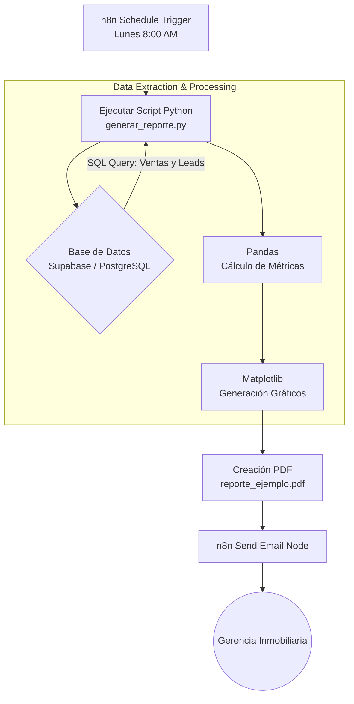

# Diagrama de Flujo del Proceso Automatizado

El siguiente diagrama explica cómo interactúan los componentes técnicos de esta solución:

## Descripción de los Nodos

1. **Schedule Trigger**: Programado usando notación cron para que se ejecute a una hora y día específicos de la semana.
2. **Execute Command (Python)**: Llama al archivo `generar_reporte.py`, el cual carga las variables de entorno de Supabase, ejecuta las consultas SQL consolidadas, realiza agrupación y sumatorias con Pandas, y dibuja en Matplotlib.
3. **Send Email**: Toma el archivo binario PDF generado por el script anterior en la carpeta `examples/` y lo envía como adjunto junto a un template de email.
